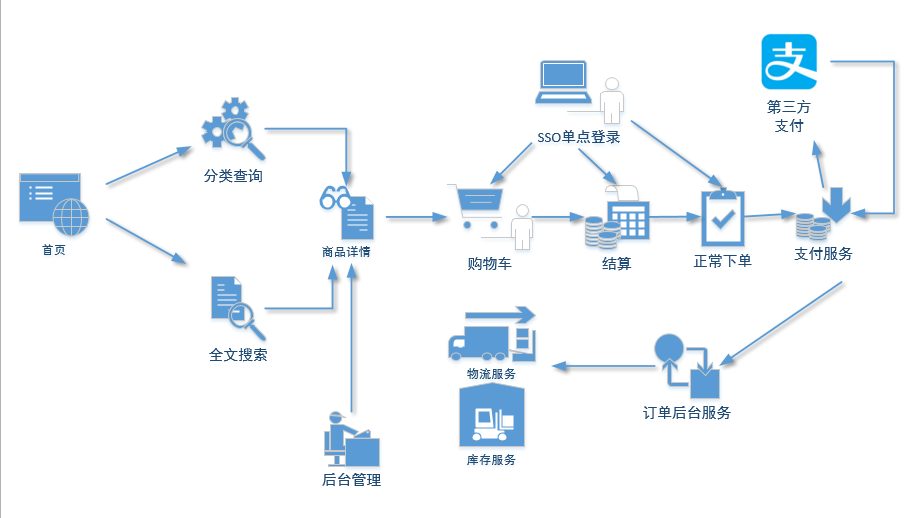

<h1 align="center"><a href="https://github.com/JQ1013/ppmall" target="_blank">PPMall</a></h1>

>PPMall 是一个分布式的电商系统，采用SpringBoot+Mybatis+Mysql等流行技术实现。

<p align="center">
<a href="https://github.com/JQ1013/ppmall/commits"></a>
<a href="https://github.com/JQ1013/ppmall/releases"></a>
</p>


## 项目文档

- 文档地址：<https://github.com/JQ1013/ppmall/blob/master/doc/ppmall.md>
- 备用地址：暂无

## 项目简介

PPMall项目是一套分布式的电商系统，是面向服务的分布式架构:包括前台商城系统及后台管理系统;

本项目主要是包含后台项目的实现逻辑,基于SpringBoot+MyBatis+Mysql实现，使用Dubbo做服务治理与发现。

前台商城系统包含首页门户、商品搜索、商品展示、购物车、订单流程、会员中心等模块。
后台管理系统包含商品管理、订单管理、会员管理、内容管理、权限管理、设置等模块。

### 组织结构

```lua
ppmall
├── ppmall-parent 		-- 父项目,做依赖的版本控制
├── ppmall-api 			-- 实体类和service接口模块
├── ppmall-common-util 		-- 通用型的第三方包，比如fastjson、httpclient、apache工具包;   
├── mppmal-service-util 	-- 通用service层模块
├── ppmall-web-util 		-- 通用web层模块
├── ppmall-member-service 	-- 用户服务的service层
├── ppmall-member-web 		-- 用户服务的web层
├── ppmall-manage-service 	-- 后台管理服务的service层
├── ppmall-manage-web 		-- 后台管理服务的web层
├── ppmall-search-service 	-- 前台的搜索服务
├── ppmall-search-web 		-- 前台搜索服务的service层
├── ppmall-item-web 		-- 前台的商品详情展示 
├── ppmall-cart-service 	-- 前台的购物车服务
├── ppmall-cart-web 		-- 前台购物车服务的service层
├── ppmall-order-service 	-- 订单服务
├── ppmall-order-web 		-- 订单控制层
├── ppmall-passport-web 	-- 认证中心:颁发token+验证真伪
├── ppmall-payment 		-- 支付服务
├── ppmall-ware 		-- 前台商城系统接口
├── ppmall-flashsale 		-- 秒杀服务
└── ppmall-redisson-test 	-- 框架搭建时的测试代码
```
### 技术选型

#### 后端技术

| 技术          | 说明                                                    | 官网                                             |
| ------------- | ------------------------------------------------------- | ------------------------------------------------ |
| SpringBoot    | 容器+MVC框架                                            | <https://spring.io/projects/spring-boot>         |
| MyBatis       | ORM框架                                                 | <http://www.mybatis.org/mybatis-3/zh/index.html> |
| MyBatis-Plus  | [MyBatis](http://www.mybatis.org/mybatis-3/) 的增强工具 | <https://mp.baomidou.com/>                       |
| Swagger-UI    | 文档生产工具                                            | <https://github.com/swagger-api/swagger-ui>      |
| Elasticsearch | 搜索引擎                                                | <https://github.com/elastic/elasticsearch>       |
| Redis         | 分布式缓存                                              | <https://redis.io/>                              |
| RabbitMq      | 消息队列                                                | <https://www.rabbitmq.com/>                      |
| Druid         | 数据库连接池                                            | <https://github.com/alibaba/druid>               |
| JWT           | JWT登录支持                                             | <https://github.com/jwtk/jjwt>                   |
| OSS           | 对象存储                                                | <https://github.com/aliyun/aliyun-oss-java-sdk>  |
| Lombok        | 简化对象封装工具                                        | <https://github.com/rzwitserloot/lombok>         |
| Jenkins       | 自动化部署工具                                          | <https://github.com/jenkinsci/jenkins>           |

### 前端技术

| 技术    | 说明         | 官网                                                  |
| ------- | ------------ | ----------------------------------------------------- |
| Vue     | 前端框架     | <https://vuejs.org/>                                  |
| Element | 前端UI框架   | [https://element.eleme.io](https://element.eleme.io/) |
| Axios   | 前端HTTP框架 | <https://github.com/axios/axios>                      |

### 架构图

#### 系统架构图



#### 业务架构图

待补充

### 模块介绍

#### 后台

- 商品管理：
- 订单管理：
- 内容管理：
- 用户管理：

### 搭建步骤


## 公众号


## 预览图